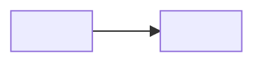

# Tech Design — <feature title>

- **Feature**: `<slug>`
- **Status**: Draft | Proposed | Approved
- **Inputs**: `01-gap-analysis.md`, PRD §<n>, <authoritative Figma link>
- **Repos**: <from _shared/repo-map.md>
- **Date**: <YYYY-MM-DD>

> This is the working engineering document — the input to `dev-plan`,
> `review` and `/to-technical-doc`. Do **not** restate the PRD here; it sits
> next to this document. Section numbers are referenced by other skills
> (§4 by `seed-data`, §5 by the data-handling checks, §7 by `dev-plan`'s PR
> policy) — keep them stable.

## 1. Context & goal

<What we're building and why, in engineering terms. One paragraph. Link the
gap analysis rather than repeating it.>

## 2. Approach

<The chosen approach in 3–6 sentences: the shape of the solution and the one
or two decisions everything else follows from.>

## 3. Architecture

<Add a sequence diagram (`diagrams/sequence.mmd`) whenever the feature spans
repos or crosses an async boundary.>

**Invariants** — what must always hold, whatever the code does:
- <invariant>

## 4. Data model & APIs

### Entities

| Entity | New/changed | Key fields | Notes |
|---|---|---|---|
| <name> | new | <field: type> | <constraints, indexes, enum values> |

### Migrations

| Repo | Migration | Reversible? | Notes on existing rows |
|---|---|---|---|
| <repo> | <what it does> | yes/no | <backfill strategy, table size> |

### API / message contracts

| Endpoint or event | Method | Request | Response | Auth |
|---|---|---|---|---|
| `<path>` | GET | <shape> | <shape> | <who may call it, object-level scoping> |

<Every cross-repo contract here needs a contract test — `dev-plan` will
require one at each boundary.>

## 5. Data handling

Mandatory. Judge against the data-handling rules in `_shared/repo-map.md`.
If this feature carries no sensitive data, state that **and justify it** —
an empty section reads as "not considered".

| Data | Source → sink | Sensitivity | Protection | Logged? |
|---|---|---|---|---|
| <field> | <flow> | none/low/med/high | <at rest / in transit / access control> | no |

- Retention / deletion: <policy, or "follows the project default">
- Third parties receiving any of this data: <none, or who and what>

## 6. Modules changed

Name real files. "The user service" is not a module reference.

| Repo | Path | Change | Why |
|---|---|---|---|
| <repo> | `<path/to/file.py>` | new / modified | <reason> |

## 7. Risks

`dev-plan` reads this table: anything **medium or higher** forces a
reviewed PR for the slice that touches it.

| Risk | Likelihood | Impact | Level | Mitigation |
|---|---|---|---|---|
| <risk> | low/med/high | low/med/high | low/med/high | <mitigation> |

## 8. Alternatives considered

Every architecturally significant decision gets an entry. If a decision
constrains future features, also write an ADR in `docs/adr/` and link it.

### <Decision>

- **Chosen**: <option> — <why>
- **Rejected**: <option> — <why not>
- **Reversible?**: <cheap to change later / one-way door>
- **ADR**: <docs/adr/NNNN-….md, if any>

## 9. Acceptance criteria (design-level)

How each PRD criterion is satisfied by this design. `review` checks the diff
against this table, so keep the AC ids from the gap analysis.

| AC | Satisfied by | Verified how |
|---|---|---|
| AC1 | <component / code path> | <test or scenario> |

## 10. Open questions

1. <question> — blocks: <what>. (team-handoff `<slug>#NNN`, if raised)
